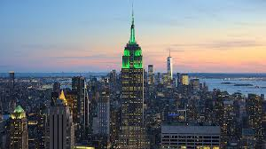
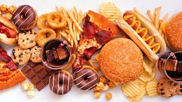

# Ollama Image Captioning & Q&A

This is a Streamlit-based web app that allows users to upload an image, generates a caption using a locally running Ollama model, and answers user questions about the image.

# Features
- Upload an image (JPG, PNG, JPEG)
- Generate an AI-generated caption
- Ask questions about the image and get responses from the AI
- Runs locally using Ollama (no API required)

---

# Sample Images and Questions

# 1. City Skyline

**Example Questions:**
- What city is this?
- How many tall buildings can you see?
- Is there a river in this image?

---

### **2. Cute Cat**

**Example Questions:**
- What breed is this cat?
- What expression does the cat have?
- What color are its eyes?

---

### **3. Mountain Landscape**

**Example Questions:**
- What is the weather like in this image?
- What kind of terrain is visible?
- Are there any trees or vegetation?

---

### **4. Delicious Food**

**Example Questions:**
- What type of dish is this?
- What ingredients might be in this meal?
- Does this food look spicy?

---

## Setup Instructions
Follow the instructions in `GitHub-Setup.txt` to  run the project.

---

